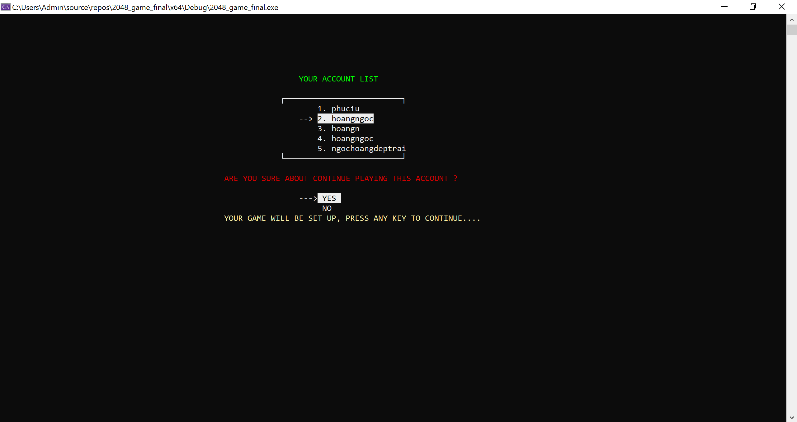

# ĐỒ ÁN GAME 2048 
*Đây là đồ án game được thiết kế bởi ngôn ngữ C++, mục đích của đồ án là đánh giá khả năng giải quyết vấn đề trong môn* ***Kỹ thuật lập trình*** *. Trò chơi được thiết kế là một bàn hình vuông gồm có các ô giá trị khác nhau, nhiệm vụ của người  chơi là kết hợp các ô đó và cố gắng đạt được con số 2048.*

---
# I. GIỚI THIỆU

---

## 1. Tác giả
**Họ và tên** : Hoàng ngọc
**Mã số sinh viên** : 23120146
**Lớp** : 23CTT2
**Khoa** : Công Nghệ Thông Tin

## 2. Cách cài đặt

Được xây dựng và thiết trên Visual Studio. Để có thể trải nghiệm trò chơi thì hãy làm theo các bước sau

- Bước 1: Tải mã nguồn về máy
- Bước 2: Giải nén 2048.zip và mở tệp 2048.sln bằng Visual Studio
- Bước 3: Run để khởi động trò chơi

## 3. Hướng dẫn chơi
- Sử dụng tổ hợp phím **A** (qua phải), **D** (qua trái), **W** (đi lên) và **S** (Đi xuống) để linh hoạt di chuyển qua các ô khác nhau. Ngoài ra ở mỗi màn hình sẽ có chỉ dẫn rõ ràng để có trải nghiệm tốt nhất.
- Các ô có cùng giá trị sẽ hợp nhất tạo thành ô có giá trị gấp đôi
- Sau mỗi lần bạn di chuyển, bàn chơi sẽ ngẫu nhiên thêm một giá trị 2 hoặc 4 vào một ô trên bàn cờ.
- Trò chơi kết thúc khi bạn đạt được một ô có giá trị 2048 hoặc bạn không thể đi được nữa và thua cuộc.

## 4. Các chức năng

- Bạn có thể đăng kí tài khoản, mật khẩu để tạo tài khoản chơi game theo yêu cầu trò chơi qua chức năng **New Game**.
- Bạn có thể chỉnh kích cỡ của bàn chời từ 4x4 đến 10x10 qua chức năng **Game Setting**.
- Bạn có thể đi lại các nước cũ bằng chức năng **Undo** và **Redo**.
- Quản lí đồng thời 5 tài khoản và mỗi lần chơi đều ghi lại thành tích cá nhân nếu trong Top 20.
- Lưu được trò chơi và có thể chơi vào bất kì lúc nào bằng chức năng **Resume**.
- Bạn có thể xem bảng xếp hạng qua chức năng **Top 20 List**.
- Điểm của bạn sẽ luôn được cập nhật liên tục trong lúc chơi.
- Sau mỗi lần chơi, nếu bạn đạt số điểm trong top, bạn sẽ được ghi lại thành tích bản thân lên bảng xếp hạng.

## 5. Xây dựng bởi
- Công cụ: Visual Studio Community.
- Ngôn ngữ: C++.
- Hệ điều hành: Window 10.

---

# II. CHI TIẾT VỀ DỰ ÁN

---

## 1. Về thư mục
- Folder 2048 chứa các cấu hình, setting của Visual Studio và mã nguồn.
- File 2048.sln để mở dự án bằng Visual Studio.

## 2. Về mã nguồn

- `README.md` là file hướng dẫn sử dụng.
- `main.cpp` là file chứa hàm để chạy trò chơi. 
- `2048 folder` có chứa các file mã nguồn chính của trò chơi, bao gồm:
    - `header.h` để khai báo tất cả các thư viện của C++ và các thư viện khác để sử dụng, ngoài ra cũng khai báo các màu sắc để tiện cho việc sử dụng màu.
    - `coreGame.h` là để khai báo các hàm chính trong việc thực hiện logic cơ bản của game như di chuyển, hợp nhất, thua cuộc, thắng cuộc, in bảng xếp hạng khi thắng (hoặc thua), cập nhật bảng xếp hạng liên tục, in giao diện bảng, tạo các số ngẫu nhiên,...
    - `menuGame.h` là thư viện khai báo những chức năng sẽ có ở giao diện đầu tiên khi ta khởi động trò chơi bao gồm như New Game, Game Setting, Resume, Top 20 List.
    - `newGame_Funtion.h` là để khai báo các thao tác cần chuẩn bị để tạo tài khoản hợp lệ và tiền xử lí game để có thể chơi game.
    - `resume_Funtion.h` là để khai báo các hàm xử lí việc đọc các file binary được lưu trữ và tái hiện lại màn chơi để tiếp tục chơi game.
    - `undoRedo.h` là khai báo các hàm dùng để xử lí chức năng undo và redo.
    - `enterGameVer1.cpp` là hàm chơi game ở chế độ undo và redo tắt. Ngược lại hàm `enterGameVer2.cpp` là hàm chơi game ở chế độ undo và redo bật. Ngoài ra còn 2 hàm `enterGameResumeVer1` và `enterGameResumeVer2` giống 2 hàm trên nhưng được xử lí hơi khác trong `resume_Funtion.cpp`
    - `gameSetting_Funtion` chứa các định nghĩa sử dụng cho chức năng setting.
    - `menuGame.cpp` chứa các định nghĩa để gọi các hàm chức năng.
    - `newGame_Funtion.cpp` chứa các định nghĩa về việc thiết lập tài khoản, kiểm tra tài khoản, tiền xử lí game, tạo game và gọi hàm chơi game.
    - `resume_Funtion.cpp` chứa các định nghĩa hàm về việc tiếp tục chơi các game đang chơi bằng cách đọc thông tin từ các file binary được lưu trữ, sau đó là gọi hàm chơi game để tiếp tục chơi.
    - `printMenuUI.cpp` là file để in giao diện đầu tiên khi khởi động game cho người chơi.
    - `top20List_Funtion.cpp` là chứa hàm định nghĩa dùng để in danh sách 20 người có số điểm đứng đầu.
    - `undoRedo.cpp` là file chứa định nghĩa các chức năng push(), pop(), tạo Stack,... phục vụ cho chức năng undo và redo.

## 3. Các màn hình chính khi chơi

### 3.1 Màn hình Menu
- Màn hình menu sẽ hiện thị các chức năng chính:
    - New Game.
    - Resume.
    - Game Setting.
    - Top 20 List

- Người chơi di chuyển bằng các phím **W** và **S**, thay đổi giá trị bằng **A** và **D**, hoặc khi bạn đồng ý với với sự lựa chọn, nhấn **J**.

### 3.2 Màn hình đăng nhập
- Màn hình đăng nhập sẽ hiển thị yêu cầu để tạo tài khoản và mật khoản và chỗ đăng nhập tài khoản và mật khẩu
- Tài khoản và mật khẩu phải thoả yêu cầu đặt ra. Ngoài ra không được trùng trong Top 20  hoăc không được trùng 5 tài khoản đang resume, nếu trùng trong top 20 thì phải đúng mật khẩu mới vô được tài khoản.
- Nếu người chơi nhập sai, người chơi có thể chọn quay về menu.

### 3.3 Màn hình danh sách tài khoản

- Màn hình này sẽ hiện thị danh sách 5 tài khoản mà bạn đang quản lí, khi không có tài khoản ở mục nào, chỗ đó sẽ hiện thị `EMPTY`, ngược lại thì sẽ hiển thị tên tài khoản.
- Bạn có thể chỉ định và thay thế bất kì tài khoản nào trong danh sách tài khoản. Khi bạn chọn, xác nhận liệu bạn có đồng ý hay không.
- Nếu bạn đồng ý thay tài khoản, hệ thống sẽ xác nhận và hiện thị một lần nữa danh sách đã được thay mới và xoá tài khoản cũ. Ngược lại nếu bạn không muốn chọn tài khoản đã chọn, bạn có thể huỷ và chọn lại.

### 3.4 Màn hình trò chơi chính

- Ở màn hình này, tuỳ vào setting mà bạn đã cài ở chức năng **Game Setting**, hệ thống sẽ tạo bàn chơi đúng như yêu cầu của bạn.
- Sẽ có 2 phiên bản khi chơi, phiên bản khi undo redo tắt và ngược lại. KHi ở phiên bản chơi có uno redo, bàn chơi của bạn sẽ hiển thị thêm các nút **U** và **R** để thực hiện chức năng này
- Ngoài ra bạn sẽ di chuyển thông qua các phím **A, W, S** và **D**. Thêm vào đó khi bạn không muốn chơi nữa, bạn có thể nhấn **E** để có thể xác nhận thoát màn chơi và lưu dữ liệu.
- Khi bàn chơi của bạn có một ô đạt đến 2048, hệ thống sẽ hiển thị thông báo chức mừng và thông báo xếp hạng bằng cách in ra bảng xếp hạng. Ngược lại khi thua, hệ thống sẽ hỏi bạn có muốn tiếp tục chơi bằng cách sử dụng chức năng undo redo không, nếu bạn chọn dừng lại thì hệ thống sẽ lưu trữ thông tin nếu bạn đạt top. Nếu bạn tiếp tục và chế độ chơi của bạn có undo redo bật thì bạn có thể sử dụng nó để chơi, ngược lại nếu undo redo tắt, việc thua cuộc đồng nghĩa với việc bạn không còn cơ hội và trở về màn hình menu chính.
- Bảng sẽ tự động phóng to thu nhỏ dựa vào giá trị ở trong bảng sao cho phù hợp.

### 3.5 Màn hình chức năng Resume
- Ở chức năng này, bạn sẽ được chọn 1 trong 5 tài khoản đang có thể tiếp tục chơi để có thể hoàn thành màn chơi của mình.
- Hệ thống sẽ hỏi bạn có chắc chắn nếu bạn chọn 1 tài khoản nào đó để chơi

### 3.6 Màn hình Game Setting
 
 Ở  màn hình này màn sẽ được tuỳ chỉnh chọn kích cỡ size của bảng hoặc bật tắt tuỳ chỉnh chế độ undo redo hoặc có thể quay về menu.

 

 ### 3.7 Màn hình danh sách Top 20

 Ở màn hình này bạn sẽ được thấy 20 người chơi có số điểm cao nhất

 

 ## 4. Lưu trữ thông tin

### 4.1 Danh sách 5 tài khoản
Được lưu trữ tên, mật khẩu, điểm, thời gian chơi, trạng thái lưu vào 1 file `accountListData.bin` Khi đăng nhập mà trùng danh sách 5 tài khoản này thì không được chơi

### 4.2 Lưu trữ Top 20 

Được lưu trữ tên, mật khẩu, thời gian chơi, điểm vào 1 file `top20List.bin` để có thể dễ dàng lấy thông tin từ 20 người chơi này.

### 4.3 Lưu trữ màn chơi

Sẽ có 5 file `account1.bin`,`account2.bin`, ... dùng để lưu trữ 5 màn chơi của chủ 5 tài khoản trong file `accountListData.bin`. Trong mỗi file sẽ lưu sizeBroad, undoRedoMode, Broad để có thể xây dựng và tiếp tục chơi.

## 5. Nguồn tham khảo

1. Tham khảo cách đọc binary file qua youtube từ [https://youtu.be/fCvJ9Rsfy6c?si=UA3TP2kKSN-xspcW](https://youtu.be/fCvJ9Rsfy6c?si=UA3TP2kKSN-xspcW)
2. Tham khảo cách dùng ANSI code từ [https://gist.github.com/fnky/458719343aabd01cfb17a3a4f7296797](https://gist.github.com/fnky/458719343aabd01cfb17a3a4f7296797)
3. Tham khảo cách viết `README.md` từ [https://youtu.be/jJky0Ws9xKg?si=ixb6dA6L4LFN1eSR](https://youtu.be/jJky0Ws9xKg?si=ixb6dA6L4LFN1eSR)

## 6. Video chứng minh tính đúng đắn

Link các video chứng minh tính đúng đắn của các chức năng sẽ được up vào drive thông qua [LINK](https://drive.google.com/drive/folders/14FU2tRa-JqJ7PbfiXhVvTodPx18lk_mb?usp=drive_link) này 

## 7. Bảng tự đánh giá 

|Chức Năng | Mức độ hoàn thành |
|--|---|
| Hiển thị được giao diện kèm chức năng của hai màn hình chính | Hoàn thành tốt|
|Thực hiện được chức năng nhập tên và kiểm tra tính trùng lắp|Hoàn thành tốt|
|Thực hiện được chức năng cài đặt độ lớn của bàn cờ| Hoàn thành tốt|
|Thực hiện được việc lưu trữ thông tin người chơi| Hoàn thành tốt|
|Thực hiện được chức năng **Resume**| Hoàn thành tốt|
|Thực hiện được chức năng **Exit** | Hoàn thành tốt|
|Thực hiện được logic trong trò chơi như phát sinh ngẫu nhiên, di chuyển, hiển thị trò chơi, hiển thị điểm, v.v| Hoàn thành tốt|
|Thực hiện được chức năng undo, undo và redo| Hoàn thành tốt|
|Hiển thị các thông báo và nội dung tương ứng | Hoàn thành tốt|
|Tổ chức thành các file rõ ràng| Hoàn thành|
|Có sử dụng phương thức đồ hoạ kèm giao diện thân thiện| Hoàn thành|
|Cài đặt được cách thức mã hoá tệp tin | Chưa hoàn thành|
|Cài đặt được chức năng Resume cho năm tài khoản| Hoàn thành tốt|
